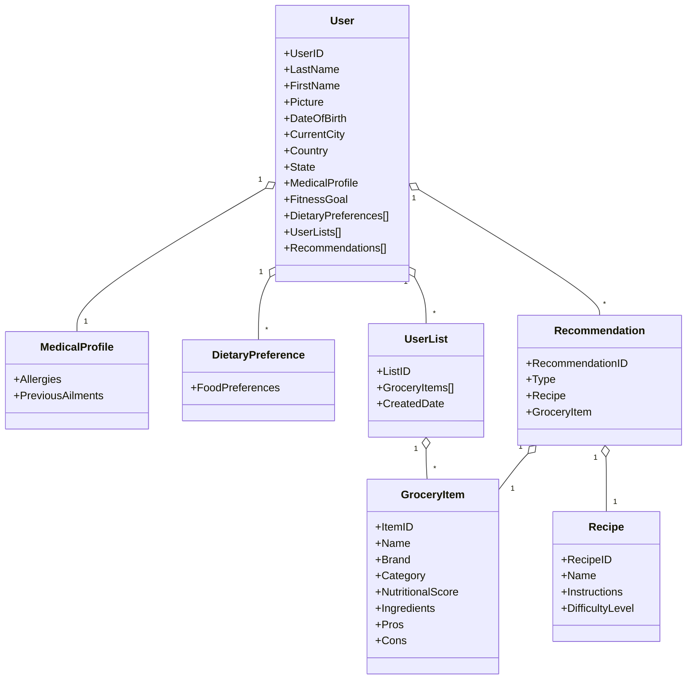

Final Project Presentation Video Link - https://northeastern-my.sharepoint.com/:v:/r/personal/hassani_h_northeastern_edu/Documents/Team%20HonoredOnes_%20Final_Project_Presentation.mp4?csf=1&web=1&nav=eyJyZWZlcnJhbEluZm8iOnsicmVmZXJyYWxBcHAiOiJTdHJlYW1XZWJBcHAiLCJyZWZlcnJhbFZpZXciOiJTaGFyZURpYWxvZy1MaW5rIiwicmVmZXJyYWxBcHBQbGF0Zm9ybSI6IldlYiIsInJlZmVycmFsTW9kZSI6InZpZXcifX0%3D&e=Or9hyG

## Project Topic

WellEat is a Health focused Recommendation and Classification App.

## Project Description

This is a comprehensive platform designed to help users make informed decisions about their diet and lifestyle. Key features include:

1. User Profile Management: Stores user information, medical history, and dietary preferences.
2. Grocery Item Classification: Categorizes grocery items based on their ingredients and nutritional value.
3. Personalized Recommendations: Provides tailored recipe and grocery item suggestions based on user profiles.
4. Shopping List Management: Allows users to create and manage shopping lists based on previous items used.
5. AI-Powered Insights: Utilizes machine learning to offer health and diet recommendations.

This app aims to promote healthier lifestyle choices by providing personalized, data-driven recommendations and easy-to-use tools to choose the right grocery items for your health.

## Prerequisites

Before running this project, ensure you have the following installed:

- [Node.js](https://nodejs.org/) (v20.17.0)
- [yarn](https://yarnpkg.com/) (v1.22.22)

---

## Installation

Follow these steps to set up the project locally:

1. Clone the repository:

   ```bash
   git clone https://github.com/info-6150-fall-2024/final-project-honoredones.git

   ```

2. Navigate to the project directory:
   ```bash
   cd final-project-honoredones
   ```
3. Copy Environment Files
   Duplicate the .env.example files located in packages/frontend and packages/backend, and rename them to .env. You can use the following commands:
   ```bash
   cp packages/frontend/.env.example packages/frontend/.env && cp packages/backend/.env.example packages/backend/.env
   ```
4. Verify Setup
   Ensure both .env files are correctly created and updated with correct environment variables before proceeding with the installation steps for the frontend and backend.
5. Install dependencies:
   ```bash
   yarn install
   ```
6. Run Development Servers (We are utilizing [concurrently](https://www.npmjs.com/package/concurrently) package in the root, so we don't need to run individual servers in packages/frontend, packages/backend)
   ```bash
    yarn run dev
   ```
7. Run Storybook
   ```bash
   yarn run storybook
   ```

## Repository Structure

We are using Monorepo structure utilizing yarn workspaces


## Architecture


## Screenshots


## Domain Model for Well Eat



<!-- ```mermaid``` -->

```
---
Title: Well Eat
---

classDiagram
    %% User Profile Context
    class User {
        +UserID
        +LastName
        +FirstName
        +Picture
        +DateOfBirth
        +CurrentCity
        +Country
        +State
        +MedicalProfile
        +FitnessGoal
        +DietaryPreferences[]
        +UserLists[]
        +Recommendations[]
    }

    class MedicalProfile {
        +Allergies
        +PreviousAilments
    }
    class DietaryPreference {
        +FoodPreferences
    }

    %% Items List Context
    class UserList {
        +ListID
        +GroceryItems[]
        +CreatedDate
    }

    class GroceryItem {
        +ItemID
        +Name
        +Brand
        +Category
        +NutritionalScore
        +Ingredients
        +Pros
        +Cons
    }

    %% Recommendation Engine Context
    class Recommendation {
        +RecommendationID
        +Type
        +Recipe
        +GroceryItem
    }

    class Recipe {
        +RecipeID
        +Name
        +Instructions
        +DifficultyLevel
    }

    User "1" o-- "1" MedicalProfile
    User "1" o-- "*" DietaryPreference
    User "1" o-- "*" UserList
    UserList "1" o-- "*" GroceryItem
    User "1" o-- "*" Recommendation
    Recommendation "1" o-- "1" Recipe
    Recommendation "1" o-- "1" GroceryItem
```

[](https://classroom.github.com/a/DIHvCS29)
