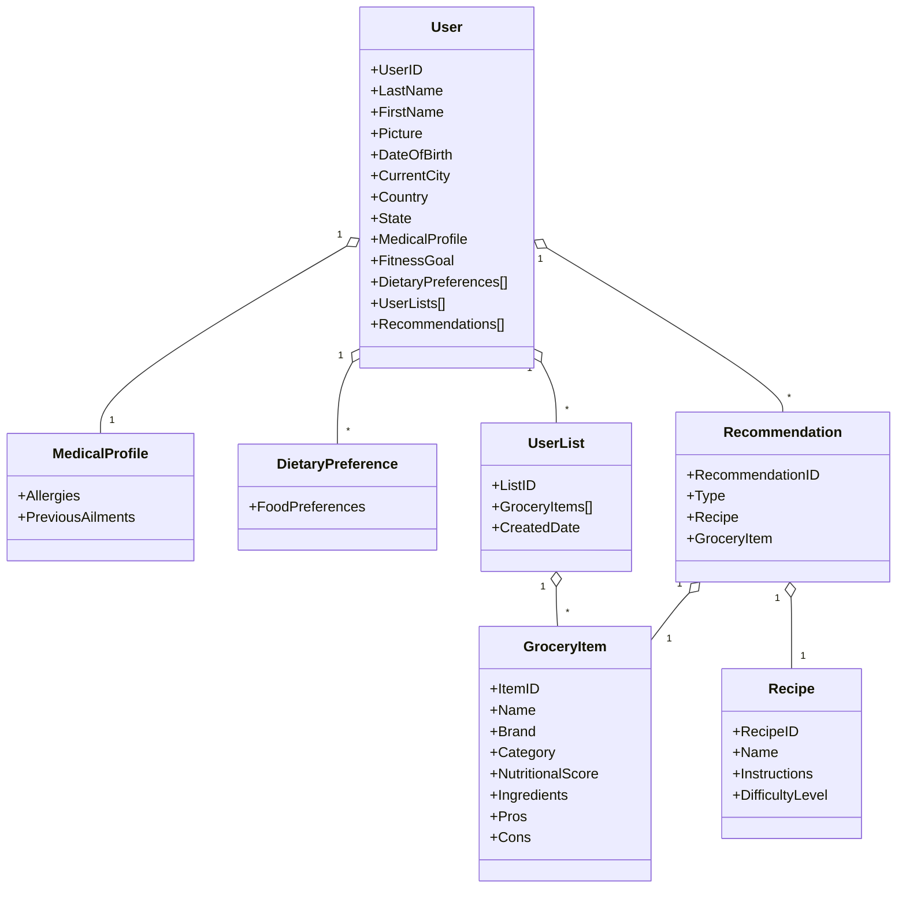

# Domain Model for Well Eat

```mermaid

---
Title: Well Eat
---

classDiagram
    %% User Profile Context
    class User {
        +UserID
        +LastName
        +FirstName
        +Picture
        +DateOfBirth
        +CurrentCity
        +Country
        +State
        +MedicalProfile
        +FitnessGoal
        +DietaryPreferences[]
        +UserLists[]
        +Recommendations[]
    }

    class MedicalProfile {
        +Allergies
        +PreviousAilments
    }
    class DietaryPreference {
        +FoodPreferences
    }

    %% Items List Context
    class UserList {
        +ListID
        +GroceryItems[]
        +CreatedDate
    }

    class GroceryItem {
        +ItemID
        +Name
        +Brand
        +Category
        +NutritionalScore
        +Ingredients
        +Pros
        +Cons
    }

    %% Recommendation Engine Context
    class Recommendation {
        +RecommendationID
        +Type
        +Recipe
        +GroceryItem
    }

    class Recipe {
        +RecipeID
        +Name
        +Instructions
        +DifficultyLevel
    }

    User "1" o-- "1" MedicalProfile
    User "1" o-- "*" DietaryPreference
    User "1" o-- "*" UserList
    UserList "1" o-- "*" GroceryItem
    User "1" o-- "*" Recommendation
    Recommendation "1" o-- "1" Recipe
    Recommendation "1" o-- "1" GroceryItem
```
