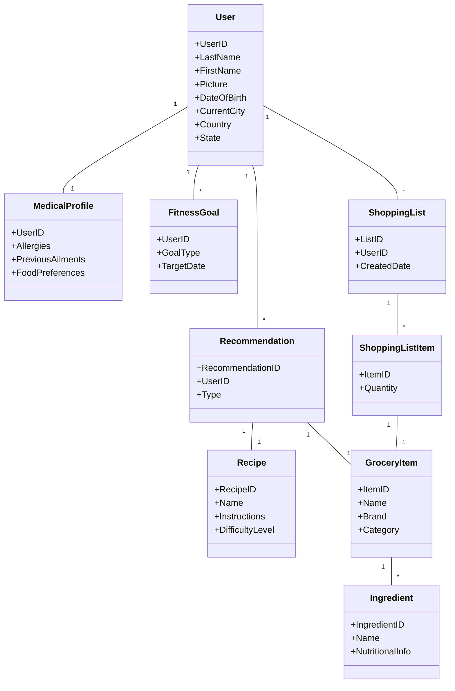

```mermaid
classDiagram
    %% User Profile Context
    class User {
        +UserID
        +LastName
        +FirstName
        +Picture
        +DateOfBirth
        +CurrentCity
        +Country
        +State
    }
    class MedicalProfile {
        +UserID
        +Allergies
        +PreviousAilments
        +FoodPreferences
    }
    class FitnessGoal {
        +UserID
        +GoalType
        +TargetDate
    }
    User "1" -- "1" MedicalProfile
    User "1" -- "*" FitnessGoal


    %% Grocery Classification Context
    class GroceryItem {
        +ItemID
        +Name
        +Brand
        +Category
    }
    class Ingredient {
        +IngredientID
        +Name
        +NutritionalInfo
    }
    GroceryItem "1" -- "*" Ingredient


    %% Recommendation Engine Context
    class Recipe {
        +RecipeID
        +Name
        +Instructions
        +DifficultyLevel
    }
    class Recommendation {
        +RecommendationID
        +UserID
        +Type
    }
    Recommendation "1" -- "1" Recipe
    Recommendation "1" -- "1" GroceryItem
    User "1" -- "*" Recommendation


    %% Shopping List Context
    class ShoppingList {
        +ListID
        +UserID
        +CreatedDate
    }
    class ShoppingListItem {
        +ItemID
        +Quantity
    }
    User "1" -- "*" ShoppingList
    ShoppingList "1" -- "*" ShoppingListItem
    ShoppingListItem "1" -- "1" GroceryItem
```
